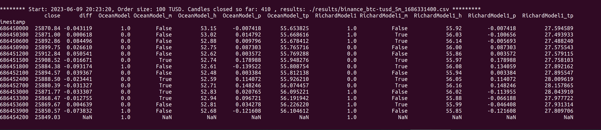

# Predictor-Model-Experiments
Predictor-Model-Experiments

This repository contain several experiments that aim to create a model that do better than random guess at predicting ETH prices

### Alex experiments
[Here](https://github.com/oceanprotocol/pdr-model-experiments/blob/main/alex/README.md)

### Example Table



Legend:
```text
close = close price for candle
diff = difference in percent vs last candle close price
OceanModel = prediction done by Jaime's model
OceanModel_m = if the prediction was accurate
OceanModel_h = hit rate (accuracy)
OceanModel_p  = profit per candle
OceanModel_tp = total profit per model
RichardModel1 = prediction using Richard's model
RichardModel1_m  = if prediction was accurate
RichardModel1_h  = hit rate
RichardModel1_p  = profit per candle
RichardModel1_tp = total profit per model
```
